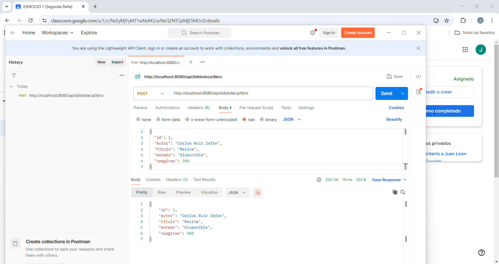
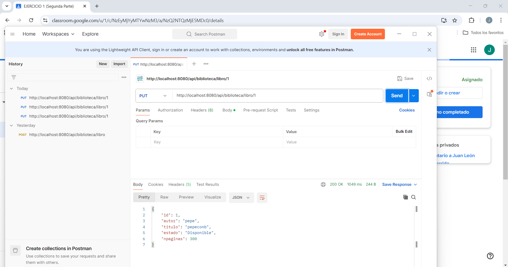
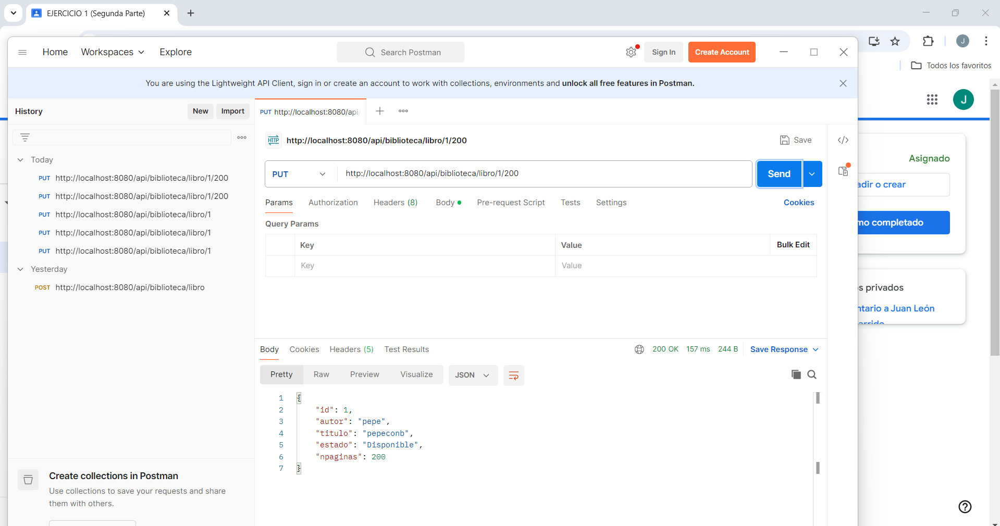
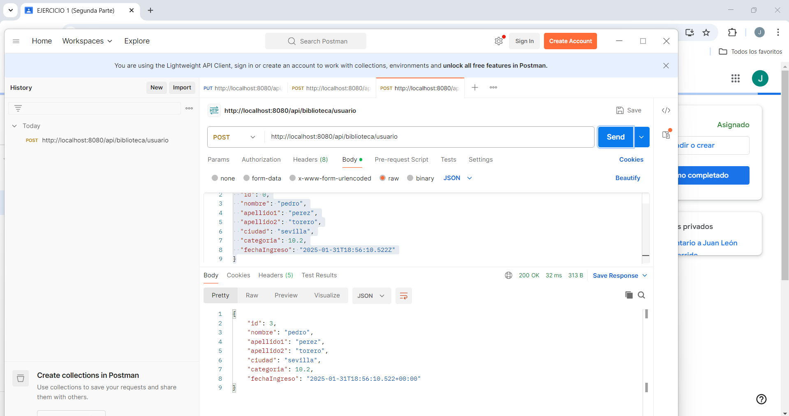
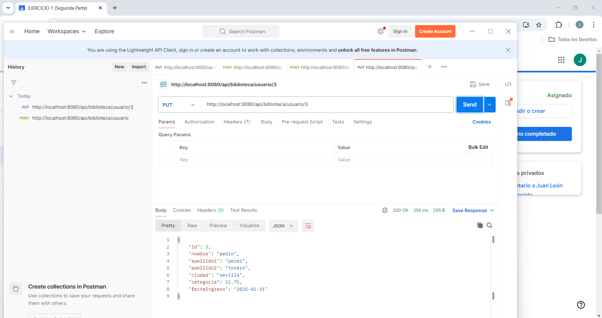
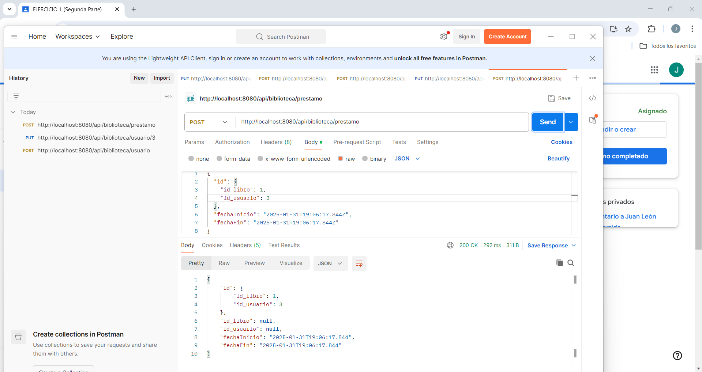
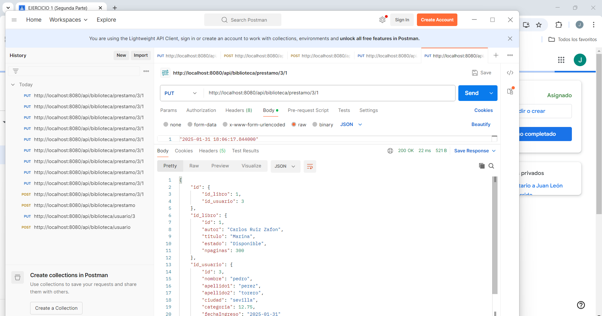

# 📚 Biblioteca API

Este proyecto es una API REST para la gestión de una biblioteca, permitiendo la administración de libros, usuarios y préstamos.

## 🚀 Tecnologías Utilizadas

- **Java** ☕
- **Spring Boot** 🌱
- **Spring Data JPA** 🗄️
- **Lombok** 🛠️
- **Base de Datos Relacional** 📊

## 📌 Endpoints Disponibles

### 📖 Gestión de Libros

| Método | Endpoint | Descripción |

**| POST | `/api/biblioteca/libro` | Añadir un nuevo libro 📚 |**
Ej:http://localhost:8080/api/biblioteca/libro
{
  "id": 1,
  "autor": "Carlos Ruiz Zafon",
  "titulo": "Marina",
  "estado": "Disponible",
  "npaginas": 300
}



**| PUT | `/api/biblioteca/libro/{idLibro}` | Actualizar estado del libro mediante el id 🔄 |**
Ej: http://localhost:8080/api/biblioteca/libro/1



**| PUT | `/api/biblioteca/libro/{idLibro}/{Npaginas}` | Actualizar número de páginas con id📄 |**
Ej: http://localhost:8080/api/biblioteca/libro/1/200



### 👤 Gestión de Usuarios

| Método | Endpoint | Descripción |

**| POST | `/api/biblioteca/usuario` | Añadir un nuevo usuario 👥 |**
Ej:http://localhost:8080/api/biblioteca/usuario
{
  "id": 0,
  "nombre": "pedro",
  "apellido1": "perez",
  "apellido2": "torero",
  "ciudad": "sevilla",
  "categoria": 10.2,
  "fechaIngreso": "2025-01-31T18:56:10.522Z"
}



**| PUT | `/api/biblioteca/usuario/{idUsuario}` | Actualizar categoría de usuario mediante id 📈 |**
Ej:http://localhost:8080/api/biblioteca/usuario/3



### 🔄 Gestión de Préstamos

| Método | Endpoint | Descripción |
|--------|---------|-------------|

**| POST | `/api/biblioteca/prestamo` | Añadir un nuevo préstamo 📅 |**
Ej:http://localhost:8080/api/biblioteca/prestamo
{
  "id": {
    "id_libro": 3,
    "id_usuario": 1
  },
  "fechaInicio": "2025-01-31T19:06:17.844Z",
  "fechaFin": "2025-01-31T19:06:17.844Z"
}



**| PUT | `/api/biblioteca/prestamo/{idUsuario}/{idLibro}` | Actualizar fecha de fin del préstamo mediante idUsuario y idLibro📆 |**
Ej:http://localhost:8080/api/biblioteca/prestamo/3/1
"2025-01-31 18:06:17.844000"



## ⚙️ Implementación

### 📌 Servicio (Service)

```java
@Service
@Slf4j
@AllArgsConstructor
public class BibliotecaService {
    private LibroRepository libroRepository;
    private UsuarioRepository usuarioRepository;
    private PrestamoRepository prestamoRepository;
}
```

### 🌐 Controlador (Controller)

```java
@RestController
@RequestMapping("/api/biblioteca")
@AllArgsConstructor
public class BibliotecaController {
    private BibliotecaService bibliotecaService;
}
```

## 📜 Licencia

Este proyecto está bajo la licencia de mi patroncito.

## Posibles errores

Puede haber errores con el si cambias el id de cero a si que sugiero no quitarlo. Además diferentes metodos estarán sujetos a cambios.

Si no se acuerda de los put y post, despues de haber arrancando spring vaya a la pagina `http://localhost:8080/swagger-ui/index.html` donde encontrara la demas informacion que tambien está sujeto a cambios

---
✍️ **Desarrollado por [José Daniel Bravo Heredia]**
